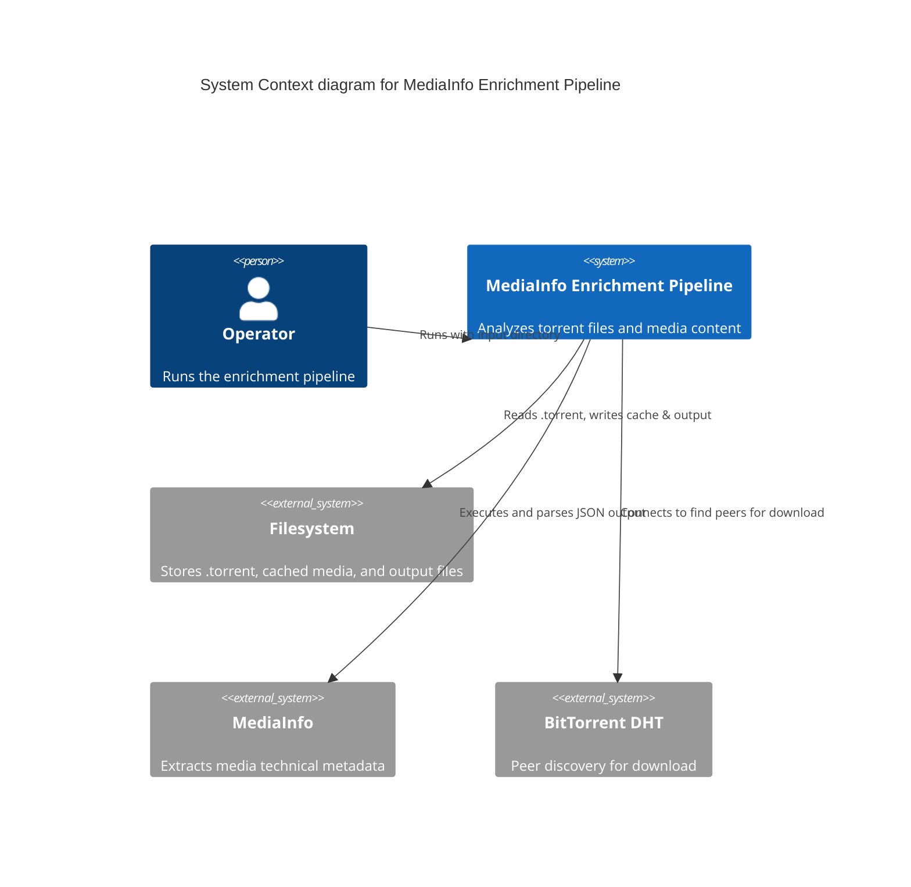
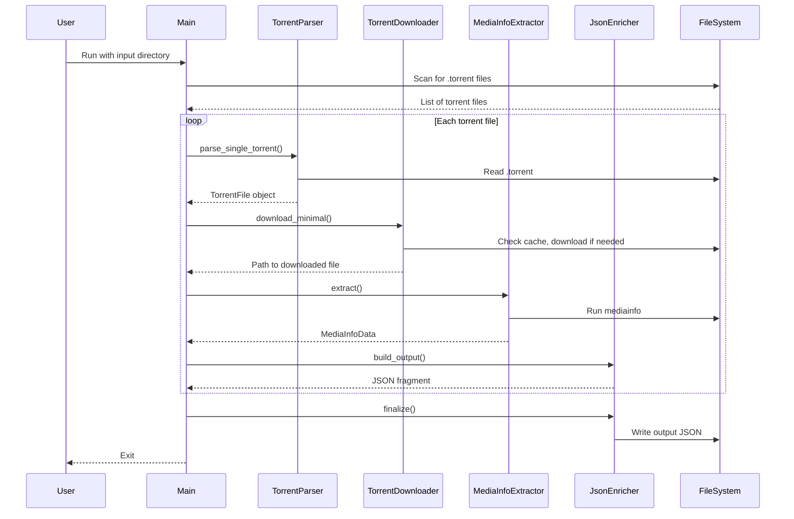

# MediaInfo Enrichment Pipeline Diagram

## System Context Diagram



## Container Diagram

```mermaid
C4Container
    title Container diagram for MediaInfo Enrichment Pipeline

    System_Ext(fs, "Filesystem", "Input .torrent files + cache")

    Container_Boundary(pipeline, "MediaInfo Enrichment Pipeline") {
        Container(torrent_parser, "Torrent Parser", "C++ + librorrent", "Parses .torrent files, extracts BTIH and metadata")
        Container(torrent_downloader, "Torrent Downloader", "C++ + libtorrent", "Downloads only the first 10MB of the media file")
        Container(mediainfo_extractor, "MediaInfo Extractor", "C++ + rapidjson", "Executes mediainfo binary, parses JSON")
        Container(json_enricher, "JSON Enricher", "C++ + rapidjson", "Combines data, outputs API-compliant JSON")
    }

    System_Ext(mi, "MediaInfo", "Media analysis tool")
    System_Ext(output, "Output File", "media_objects_content_analysis.json")

    Rel(torrent_parser, fs, "Reads .torrent files")
    Rel(torrent_downloader, fs, "Writes/reads cache")
    Rel(torrent_downloader, dht, "Peers")
    Rel(medianfo_extractor, mi, "Executes")
    Rel(json_enricher, output, "Writes")
```

## Component Sequence Diagram



## Data Structure Diagram

The core data structures ``TorrentFile`, ``MediaInfoData`, ``VideoInfo`, etc., are defined in `torrent_parser.hpp` and `mediainfo_extractor.hpp` . The `JsonEnricher` assembles them into the final API object. Refer to `data-structure-diagram.svg` for a visual representation.

## Build and Runtime Flow

```mermaid
flowchart TD
    A[Install Dependencies] --> B[Clone Repository]
    B --> C[Run CMake]
    C --> D[Make Build]
    D --> E[Run Executable with Input Directory]

    E --> F{Input Directory Exists?]
    F -->|No| G[Error]
    F -->|Yes| H[Parse .torrent files]

    H --> I{Check cache?}
    I -->|Miss| J[TorrentDownloader downloads first 10MB]
    I -->|Hit| K[Use cached file]

    J --> L[MediaInfoExtractor analyzes file]
    K --> L
    L --> M[JsonEnricher builds JSON]
    M --> N[Write output file]
    N --> O[Done]
```

## Legend

For a detailed legend of the diagram components, see `legend.svg` in this directory. The diagrams use standard C4 model conventions (System, Container, Component, Person, External System) and standard flowchart shapes.
